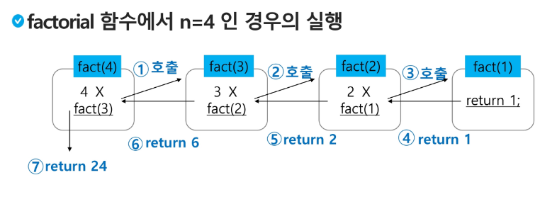

### 스택의 push 알고리즘
```python
def push(item, size):
    global top
    top += 1
    if top == size:
        print('overflow!')
    else:
        stack[top] = item

size = 10
stack = [0] * size
top = -1

push(10,size)
top += 1   #push 20
stack[top] = 20
```

### 스택의 pop 알고리즘
```python
def pop():
    if len(s) == 0:
        # underflow
        return
    else:
        return s.pop()

def pop():
    global top
    if top == -1:
        print('underflow'0)
        return 0
    else:
        top -= 1
        return stack[top+1]

print(pop())

if top > -1: # pop()
    top -= 1
    print(stack[top+1])
```
#### 재귀호출(중요!!!!!!!!!!!!!!!!!!!!!!!!!!!!!!!!!!)

- 필요한 함수가 자신과 같은 경우 자신을 다시 호출하는 구조
- 함수에서 실행해야 하는 작업의 특성에 따라 일반적인 호출방식보다 재귀호출방식을 사용하여 함수를 만들면 프로그램의 크기를 줄이고 간단하게 작성

