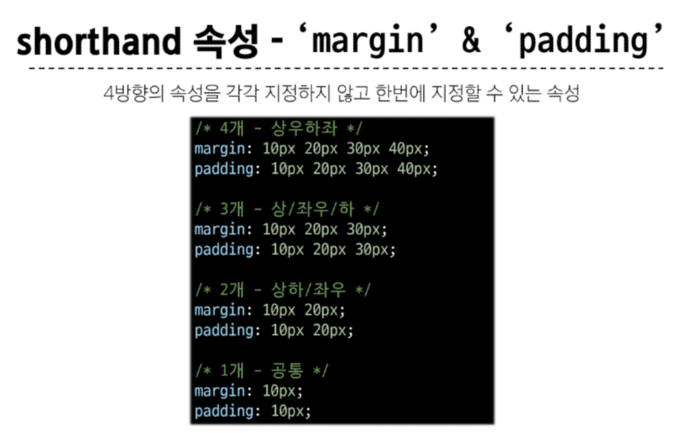

### CSS Box Model
- 박스 표시 타입
    - Outer display type
    block:항상 새로운 행, width 속성을 지정하지 않으면 박스는 inline 방향으로 사용 가능한 공간 모두 차지
    inline : 새로운 행으로 넘어가지 않음, width아 height 속성 사용 x
    - Inner display type

- Box 구성 요소 : content, 안쪽 여백(padding), 테두리(border), 외부 간격(margin)
- content : width와 height 속성으로 content 크기를 결정
- 
  
- margin,padding 
- 

- box-sizing 속성
- 기본값은 content-box로 되어 있어서 border-box로 설정하고 테두리 가로 세로 조정