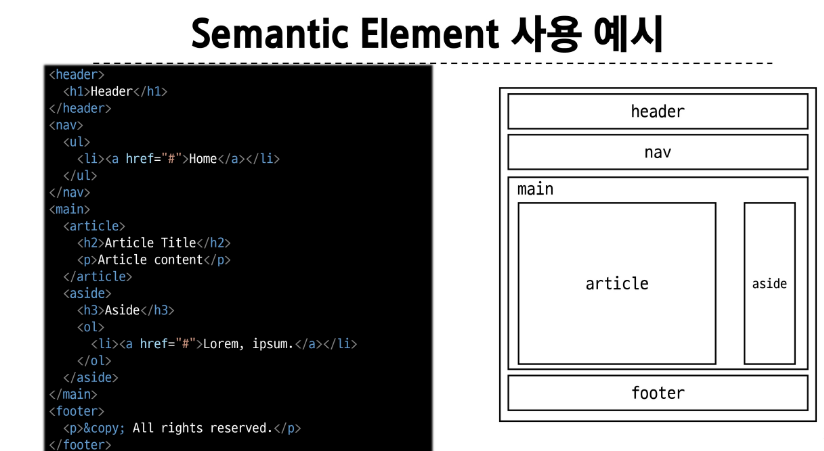
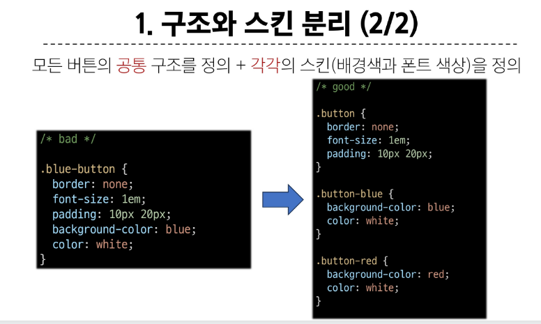
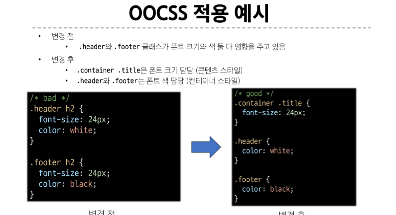

# Bootstrap
carousel 사용할 때 data-bs-target 잘 살펴보기 (2개 이상 사용할 때)
- carousel id 속성 값과 각 버튼의 data-bs-target 속성 값이 올바르게 작성되어 있는지 확인!!!!!!

modal을 만들어서 사용할 때 상속시키지 말고 최하단에 모아두는 것을 권장(modal 본체는 버튼을 눌러야만 활성되는 코드이기 때문)
- carousel과 마찬가지로 modal id 속성 값과 버튼의 속성 값 확인
- modal 버튼과 modal 본체가 함께 다닐 필요가 없다.

### Semantic Web 
웹 데이터를 의미론적으로 구조화된 형태로 표현하는 방식

- HTML Semantic Element: 기본적인 모양과 기능 이외에 의미를 가지는 HTML 요소
  -> 검색엔진 및 개발자가 웹 페이지 콘텐츠를 이해하기 쉽게 하기 위해
- 

- Semantic CSS
    - CSS 방법론
      - OOCSS: 객체 지향적 접근법을 적용하여 CSS를 구성하는 방법
        1. 구조와 스킨을 분리
   
        2. 컨테이너와 콘텐츠를 분리
        - 객체에 직접 적용하는 대신 객체를 둘러싸는 컨테이너에 스타일을 적용
        
  