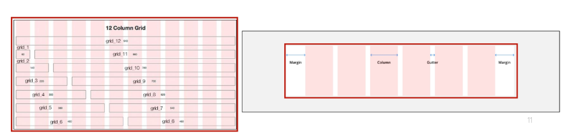
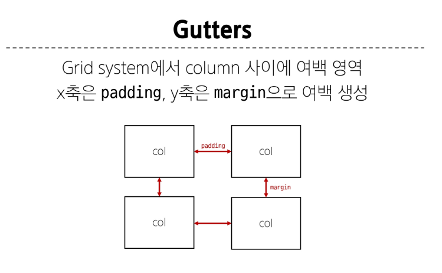

### Bootstrap Grid system
웹 페이지의 레이아웃을 조정하는 데 사용되는 12개의 컬럼으로 구성된 시스템
-> 12개로 구성된 이유: 약수가 많고 적당히 큰 수라서
- Grid system 목적
  반응형 디자인을 지원해 웹 페이지를 모바일, 태블릿, 데스크탑 등 다양한 기기에서 적절하게 표현할 수 있도록 도움

##### Grid system 기본 요소
1. Container: Column들을 담고 있는 공간

2. Column : 실제 컨텐츠를 포함하는 부분
3. Gutter: 컬럼과 컬럼 사이의 여백 영역
4. 1개의 row안에 12개의 column 영역이 구성 -> 각 요소는 12개 중 몇개를 차지할 것인지 지정됨

Gutters

좌우는 padding, 상하는 margin

### Grid system for responsive web
- Grid system breakpoints(6개): 웹 페이지를 다양한 화면 크기에서 적절하게 배치하기 위한 분기점, 각 breakpoints 마다 설정된 최대 너비 값 이상으로 화면이 커지면 grid system 동작이 변경됨
  xs,sm,md,lg,xl,xxl -> xs는 .col- 나머지는 이름 그대로