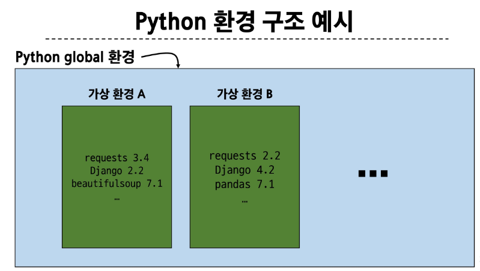
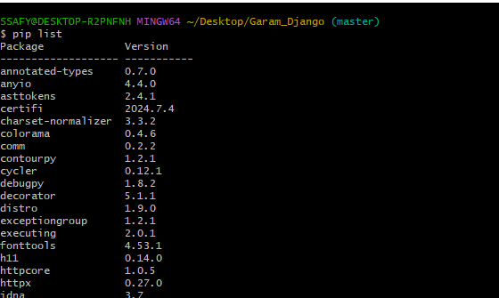
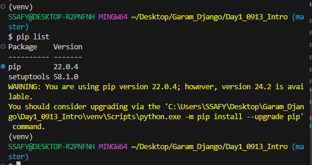
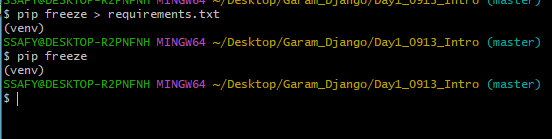

# Django

### 가상 환경
- Python 애플리케이션과 그에 따른 패키지들을 격리하여 관리할 수 있는 독립적인 실행 환경 (global x)
- 여러개의 프로젝트를 진행할 때 다른 패키지 버전을 써야하는 상황이 오고, 충돌을 방지하기 위해 각각 독립적인 개발 환경이 필요

- 가상환경 생성 후 on off -> $ source venv/Scripts/activate, macOs: source venv/bin/activate

#### 가상환경 off 한 상태 
- 터미널 종료하거나 , deactivate 

#### 가상환경 on 한 상태

#### 패키지 목록 

-> 필요한 이유: 가상 환경에 대한 정보가 공유 되어야 협업시 문제가 발생했을 때 대처할 수 있다.
- 현재 버전 기록 pip freeze > requirements.txt
- 패키지 목록을 기반으로 설치하는 명령어: pip install -r requirements.txt

### Django project
1. Django 프로젝트 생성
- $ django-admin startproject firstpjt .(현재 디렉토리에 프로젝트 생성)

2. Django 서버 실행
- $ python manage.py runserver

 ### Django Design Pattern
 - 소프트웨어 설계에서 발생하는 문제를 해결하기 위한 일반적인 해결책(형식화 된 관행)

 #### MVC 디자인 패턴
 - 하나의 프레임워크 구성을 3등분 하겠다.(Mode, View, Controller)  데이터 , 사용자 인터페이스, 비즈니스 로직
 #### MTV 디자인 패턴
 - Django에서 애플리케이션을 구조화하는 패턴(Model, Template, View)
 #### 프로젝트와 앱
 - Django project: 애플리케이션의 집합(DB설정, URL 연결, 전체 앱 설정 등을 처리)
 - Django app: 독립적으로 작동하는 기능 단위 모듈
 1. 앱 생성
 - $ python manage.py startapp articles (앱 이름은 복수형으로 지정하는 것을 권장)

 #### 프로젝트 구조
 - settings.py : 프로젝트의 모든 설정을 관리
 - urls.py: 요청 들어오는 URL에 따라 이에 해당하는 적절한 views를 연결