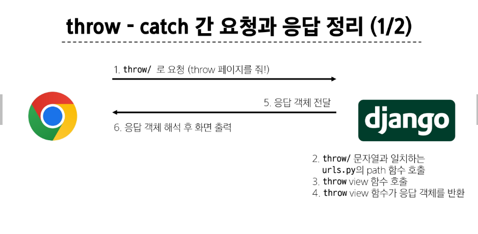
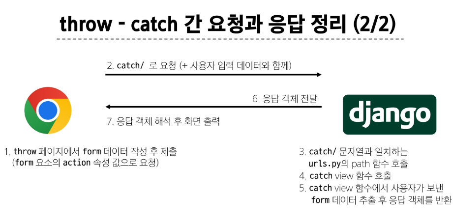

# Template & URLs
#### 템플릿 상속
extends 태그 : 템플릿 최상단에 작성되어야 함
block 태그

#### 요청과 응답

- https://search.naver.com/search.naver ? where=nexearch&sm=top_hty&fbm=0&ie=utf8&query=싸피

-> URL  ?  파라미터(5개의 데이터)

- https://search.naver.com/search.naver?query=싸피
    목적지 URL                           input의 name 속성
                                         input에 입력한 데이터
-> 똑같은 검색 기능

### HTML form
- action
  - 입력 데이터가 전송될 URL을 지정(목적지)
  - 만약 이 속성을 지정하지 않으면 데이터는 현재 form이 있는 페이지의 URL로 보내짐
- method
  - 데이터를 어떤 방식으로 보낼 것인지 정의

- name 
  - input의 핵심 속성
  - 사용자가 입력한 데이터에 붙이는 이름(key)
- Query String Parameters

### HTTP request 객체
- form으로 전송한 데이터 뿐만 아니라 Django로 들어오는 모든 요청 관련 데이터가 담겨 있음

- 요청과 응답 과정

### Django URLs
##### Variable Routing
- URL 일부에 변수를 포함시키는 것 
<path_converter:variable_name>
