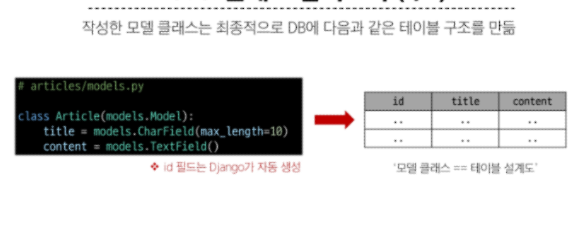
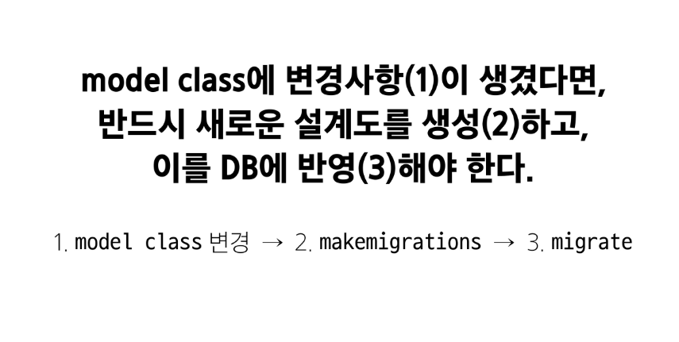

# Model

### model 클래스

- title,content와 같이 클래스 변수명은 테이블의 각 "필드(열) 이름"

- CharField,TextField와 같이 Model Field는 데이터베이스 테이블의 열(column)을 나타내는 중요한 구성  요소
- "데이터의 유형"과 "제약 조건"을 정의

##### Model Field 

1. Field Types (필드 유형)
- 데이터베이스에 저장될 "데이터의 종류"를 정의
- models 모듈의 클래스로 정의되어 있음

2. Field Option
- 필드의 동작과 제약조건을 정의
- 주요 필드 옵션: null, blank(form에서의 빈 값), default
##### 제약조건 
- 특정 규칙을 강제하기 위해 테이블의 열이나 행에 적용되는 규칙이나 제한사항

##### Migrations
- model 클래스의 변경사항을 DB에 최종 반영하는 방법
model의 사항을 수정하고 python manage.py makemigrations를 통해 수정 사항을 저장

##### DataTimeField 
-> auto_now_add, auto_now