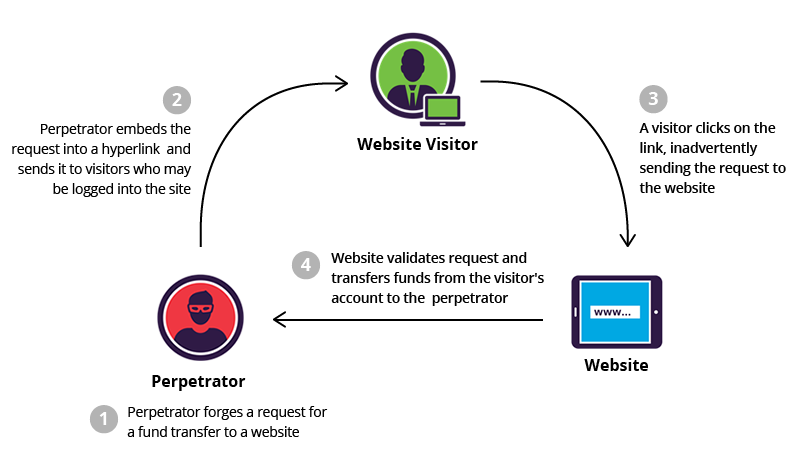

# ORM with view
- QuerySet API를 직접 view 함수에서 사용

#### create
- create를 view함수에서 구현
```py  
  def create(request):
    # 1. 사용자 요청으로부터 입력 데이터를 추출
    # 2. 추출한 입력 데이터를 활용해 DB에 저장 요청
    title = request.GET.get('title')
    content = request.GET.get('content')
    # 데이터 저장 3가지 방법
    # 1
    # article = Article()
    # article.title = title
    # article.content = content
    # article.save()

    # 2
    article = Article(title = title ,content = content)
    article.save()
    # 유효성 검사와 가독성을 위해 2번 방법을 선택

    #3
    # Article.objects.create(title = title ,content = content)
```


### HTTP request methods
- GET Method는 검색 쿼리 전송, 웹 페이지 요청, API에서 데이터 조회와 같이 조회를 할 때 주로 사용한다.
- POST Method는 서버에 데이터를 제출하여 리소스를 변경(생성,수정,삭제) 하는 데 사용 -> 로그인 정보 제출, 파일 업로드, 새 데이터 생성, API에서 데이터 변경 요청 등등
  - HTTP Body를 통해 데이터를 전송
  - GET에 비해 더 많은 양의 데이터 전송
  - POST 요청은 브라우저 스택에 남지 않음
  - POST 요청은 기본적으로 캐시 불가 (POST 요청이 일반적으로 서버의 상태를 변경하는 작업을 수행하기 때문)

### CSRF
- 사용자가 자신의 의지와 무관하게 해커가 의도한 행동을 하여 특정 웹 페이지를 보안에 취약하게 하거나 수정, 삭제 등의 작업을 하게 만드는 공격 방법

##### CSRF 방어
- CSRF Token 적용


### Redirect
데이터 저장 후 페이지를 응답하는 것이 아닌 사용자를 적절한 페이지로 보내는 함수(클라이언트가 인자에 작성된 주소로 다시 요청을 보냄)


