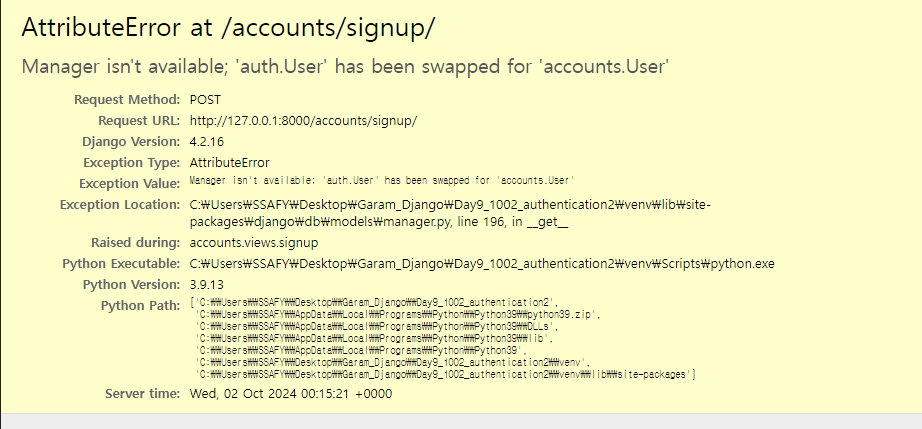

# Authentication System 02

#### 회원가입 과정
- Form이 아닌 ModelForm 사용

- 기존 로그인 과정과 똑같이 views 함수를 작성하면 아래와 같이 Error가 뜬다.

-> UsercreationForm을 그대로 상속 받아서 forms.py의 model 속성을 바꿔줘야 한다.
-> UserChangeForm도 같이 작성해줘야 한다.

```py
from django.contrib.auth.forms import UserCreationForm
# django는 User 모델을 직접 참조하는 것을 권장하지 않는다?
# why? User 클래스의 이름이 바뀌거나 다른 user class로 대체 되는 상황이 오면 User를 참조한 부분을 다 바꿔야 하기 때문에
# 유지보수가 힘들어 진다
# User 모델을 간접적으로 참조할 수 있는 방법을 별도로 제공.
from django.contrib.auth import get_user_model #(권장하는 방법)
from .models import User

class CustomUserCreationForm(UserCreationForm):
    class Meta(UserCreationForm.Meta):
        model = User
```

- get_user_model() : 현재 프로젝트에서 활성화된 사용자 모델을 반환하는 함수

- get_user_model()을 사용해 User 모델을 참조하면 커스텀 User 모델을 자동으로 반환해주기 때문에 필수적으로 get_user_model()을 사용해 참조해야 한다.


##### 회원 탈퇴 과정
- CRUD delete 과정에서는 변수 라우팅을 통해 user의 pk를 가져와야 했지만 회원탈퇴를 진행 할 때는 누가 요청한건지 User모델에서 검색할 필요가 없다.
- why? request.user를 통해 user의 정보를 가져올 수 있기 때문에 필요가 없다. (request 객체에 요청을 보내서)


##### 회원정보수정
- 회원정보 수정시 UserChangeForm을 사용하는데 User 모델의 모든 정보를(fields)까지 모두 출력된다. 
- 일반 사용자들이 접근해서는 안되는 정보는 출력하지 않도록 해야 함
-> CustomUserChangeForm에서 출력 필드를 다시 조정하기


#### 비밀번호 변경
- 비밀번호 변경시 세션이 무효화 되면서 로그아웃이 되는데 이를 방지하기 위한 함수가 있다.
- update_session_auth_hash
-> 비번이 변경되면 새로운 password의 세션 데이터로 기존 세션 갱신
- 위의 과정이 필수는 아님. 사용자의 편의를 위해서 적용해도 되고 안해도 됨


##### 로그인 사용자에 대해 접근을 제한하는 방법
1. is_autheticated 속성
- 사용자가 인증 되었는지 여부를 알 수 있는 User model의 속성
-> 모든 User 인스턴스에 대해 항상 True, 비로그인 사용자에 대해서는 항상 False
2. login_required 데코레이터
- 로그인된 사용자에 대해서만 view 함수를 실행시키는 데코레이터
-> 비로그인 사용자의 경우 /accounts/login 주소로 redirect 시킴