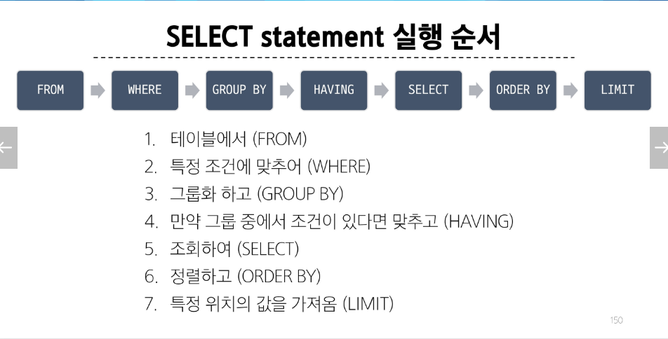

# Database


#### 관계형 데이터베이스
- 테이블, 행, 열의 정보를 구조화하는 방식
- 여러 테이블을 논리적으로 연결하여 관계가 있는 테이블들을 사용하여 데이터를 다양한 형식으로 조회할 수 있음


##### 관계형 데이터 관련 키워드

1. Table : 데이터를 기록하는 곳
2. Field : 테이블안에 고유한 데이터 형식
3. Record : 구체적인 데이터 값 저장
4. Databasae : 테이블의 집합
5. Primary Key : 각 레코드의 고유한 값
6. Foreign Key : 테이블의 필드 중 다른 테이블의 레코드를 식별할 수 있는 키, 다른 테이블의 pk를 참조
---

# SQL

### SQL Syntax

``` 
SELECT column_name FROM table_name;
```
1. SQL 키워드는 대소문자를 구분하지 않지만 명시적인 구분을 위해 대문자로 작성하는 것을 권장
2. 각 SQL Statements의 끝에는 세미콜론이 필요

---

### SQL Statements
ex) 
``` 
SELECT column_name FROM table_name;
```
-> SELECT Statements
- SELECT와 FROM 2개의 키워드로 구성


#### SQL Statements 유형
1. DDL(데이터 정의)
- CREATE, DROP, ALTER
2. DQL(데이터 검색)
- SELECT
3. DML(데이터 조작)
- INSERT, UPDATE, DELETE
4. DCL(데이터 제어)
- COMMIT, ROLLBACK, GRANT, REVOKE


##### Single Table Queries
1. Querying data
- DQL의 SELECT 
  - SELECT 키워드 이후 필드를 하나 이상 지정
  - FROM 키워드 이후 하나의 테이블 지정
2. Sorting data
  - ORDER BY 
    - FROM 뒤에 위치, ASC(오름차순, 기본값임) , DESC(내림차순)

-> SELECT statement는 FROM에서 가져온 테이블에서 SELECT를 통해 필드를 조회한 다음 ORDER BY를 통해 정렬
-  FROM -> SELECT -> ORDER BY
3. Filtering data
- Clause : DISTINCT, WHERE, LIMIT
- Operator : BETWEEN, IN, LIKE, Comparison, Logical

###### DISTINCT 
- SELECT 키워드 바로 뒤에 작성, 중복 제거

###### WHERE
- FROM 뒤에 위치, 조회시 특정 검색 조건을 지정
  - NULL 값을 검색할 때는 '='가 아닌 'IS'를 사용
  - BETWEEN : <= 값  <=

###### || 
- 2개 이상의 컬럼을 합쳐서 조회하기
##### SELECT statement 실행 순서(종합)

