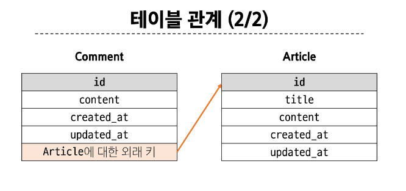

# DB 
### Many to one relationships 01

- Many to one relationships -> N:1 or 1: N
  - 한 테이블의 0개 이상의 레코드가 다른 테이블의 레코드 한 개와 관련된 관계

- N:1 관계
-> Comment(N) - Article(1) : 0개 이상의 댓글은 1개의 게시글에 작성될 수 있다.



-댓글 모델
```py
참조하는 클래스 모델의 단수형 = models.ForeignKey(to, on_delete)
# to: 참조하는 모델 class 이름
# on_delete: 외래 키가 참조하는 객체(1)가 사라졌을 때, 외래 키를 가진 객체(N)를 어떻게 처리할 지를 정의하는 설정(데이터 무결성) 
# on_delete = models.CASCADE : 참조 된 객체(부모 객체)가 삭제 될 때 이를 참조하는 모든 객체도 삭제되도록 지정
```


### 관계 모델 참조
---

##### 역참조
- N:1 관계에서 1에서 N을 참조하거나 조회하는 것(1->N)
- 모델 간의 관계에서 관계를 정의한 모델이 아닌, 관계의 대상이 되는 모델에서 연결된 객체들에 접근하는 방식
-> N은 외래 키를 가지고 있어 물리적으로 참조가 가능하지만, 1은 N에 대한 참조 방법이 존재하지 않아 별도의 역참조 키워드가 필요

- > ex) article.comment_set.all()
-  >모델 인스턴스.related manager(역참조 이름)

-> 특정 게시글에 작성된 댓글 전체를 조회하는 요청

- related manger: N:1 혹은 M:N 관계에서 역참조 시에 사용하는 매니저
  
  -> objects처럼 related manager를 통해 QuerySet API를 사용할 수 있게 됨

##### related manager 이름 규칙
- N:1 관계에서 생성되는 이름은 "모델명_set" 형태로 자동 생성됨
- 특정 댓글의 게시글 참조(Comment - > Article) 
   - comment.article
- 특정 게시글의 댓글 목록 참조(Article -> Comment)
  - article.comment_set.all()

### Many to one relationships 2

#### User와 다른 모델 간의 모델 관계 설정
1. User & Article(N)
2. User & Comment(N)

**Article과 User 모델 간의 관계 설정**
- User 모델을 참조하는 2가지 방법


### ERD
- 'Entity-Relationship Diagram
- 데이터베이스의 구조를 시각적으로 표현하는 도구
- Entity(개체), 속성, 그리고 엔티티 간의 관계를 그래픽 형태로 나타내어 시스템의 논리적 구조를 모델링하는 다이어그램


#### ERD의 구성요소
1. Entity : 데이터베이스에 저장되는 객체나 개념 (고객,주문,제품)
2. 속성 : Entity의 특성이나 성질(고객의 이름,주소,전화번호)
3. 관계 : Entity 간의 연관성(고객이 '주문'한 제품)

#### 개체와 속성

#### 관계
