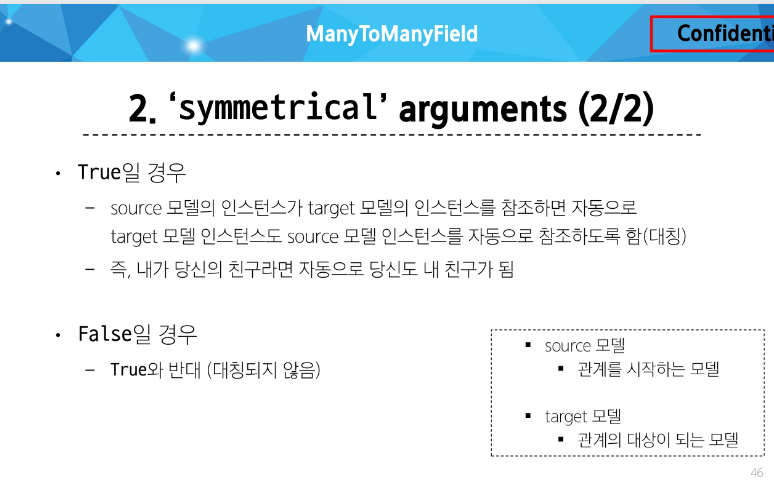

# Many to many relationships

#### ManyToManyField 
- M:N 관계 설정 시 사용하는 모델 필드
- 양방향 관계: 어느 모델에서든 관련 객체에 접근할 수 있음
- 중복 방지: 동일한 관계는 한 번만 저장됨

- 대표 인자 3가지
1. related_name 
: 역참조시 사용하는 manager name을 변경
2. symmetrical 
: 관계 설정 시 대칭 유무 설정, ManyTomanyField가 동일한 모델을 가리키는 정의에서만 사용, default : True

3. through
: 사용하고자 하는 중개모델을 지정, 일반적으로 "추가 데이터를 M:N 관계와 연결하려는 경우"에 활용
