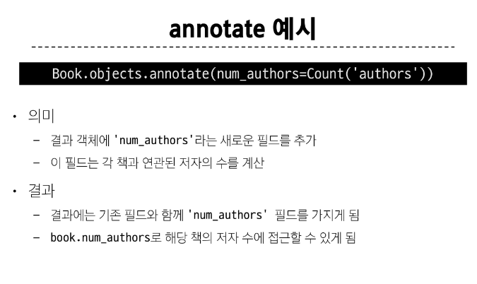
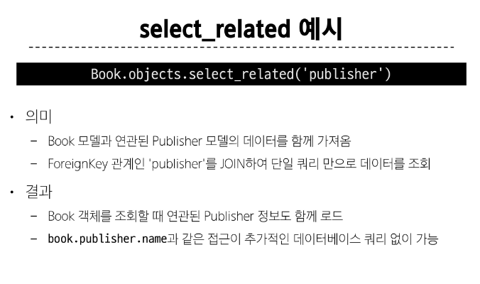
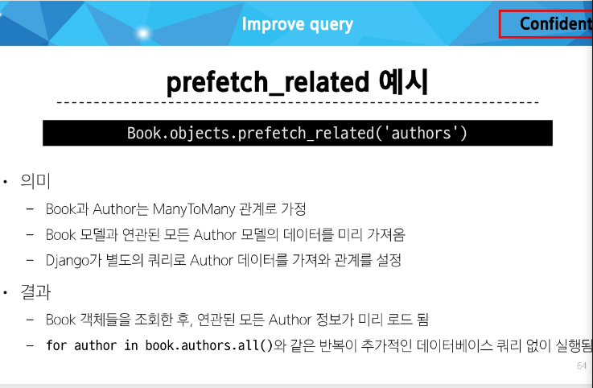

# Many to many relationships 2

### 팔로우 기능 구현
##### 프로필 페이지
- 각 회원의 개인 프로필 페이지에 팔로우 기능을 구현하기 위해 프로필 페이지 먼저 구현
- view 함수 
``` py
from django.contrib.auth import get_user_model
# get_user_model()로 User 인스턴스 생성 후 인자로 받은 username으로 
# person = User.objects.get(username= username) person 인스턴스 생성 후 context로 가져오기
```
##### 모델 관계 설정

< User(M) - User(N)>
- 0명 이상의 회원은 0명 이상의 회원과 관련
-> 회원은 0명 이상의 팔로워를 가질 수있고, 0명 이상의 다른 회원들을 팔로잉 할 수 있음


``` py
class User(AbstractUser):
  followings = models.ManyToManyField('self', symmetrical = False)
# symmetrical = False로 비대칭적인 관계를 형성
```


### Fixtures

- Django가 데이터베이스로 가져오는 방법을 알고 있는 데이터 모음 - > 데이터는 데이터베이스 구조에 맞추어 작성 되어 있음.

- 사용 목적은 **초기 데이터 제공**

#### 초기 데이터의 필요성
- 


### Improve query

#### annotate 
- SQL의 GROUP BY를 사용
- 쿼리셋의 각 객체에 계산된 필드를 추가
- 집계 함수(Count, Sum 등)와 함께 자주 사용됨
```py
모델.objects.annotate(추가할 필드명 = 집계함수(''))
```
예시 ) 


#### select_related

- SQL의 INNER JOIN을 사용
- 1:1 또는 N:1 참조 관계에서 사용
```py
모델.objects.select_related('외래키 관계')
```
예시) 



#### prefetch_related
- SQL이 아닌 Python을 사용한 JOIN을 진행
- M:N 또는 N:1 역참조 관계에서 사용

예시) 



#### select_related & prefetch_related


