# DRF

### API(Application Programming Interface)
- 두 소프트웨어가 서로 통신할 수 있게 하는 메커니즘
-> 클라이언트 - 서버처럼 서로 다른 프로그램에서 요청과 응답을 받을 수 있도록 만든 체계

### Web API
- 웹 서버 또는 웹 브라우저를 위한 API
- 현대 웹 개발은 여러 Open API 들을 활용

# REST API
- REST: API Server를 개발하기 위한 일종의 소프트웨어 설계 방법론
- 필요성: API Server를 설계하는 구조가 서로 다르니 기준을 제공(이 기준에 맞춰서 설계)

### RESTful API
- Rest 원리를 따르는 시스템을 RESTful 하다고 부름
- '자원을 정의' 하고 '자원에 대한 주소를 지정'하는 전반적인 방법을 서술

### REST API  
- REST라는 설계 디자인 약속을 지켜 구현한 API
**REST에서 자원을 정의하고 주소를 지정하는 방법**

---
1. 자원의 식별 - URI
  - Uniform Resource Identifier(통합 자원 식별자): 인터넷에서 리소스(자원)를 식별하는 문자열 | 가장 일반적인 URI는 웹 주소로 알려진 URL
    - URL : 웹에 주어진 리소스의 주소 -> 네트워크 상에 리소스가 어디 있는지를 알려주기 위한 약속
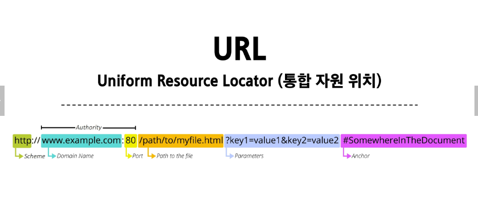
- Schema (or Protocol)
  - 브라우저가 리소스를 요청하는 데 사용해야 하는 규약
  - URL의 첫 부분은 어떤 규약을 사용하는지를 나타냄
  - 기본적으로 웹은 http(s)를 요구
- Domain Name
  - 요청 중인 웹 서버를 나타냄
  - 어떤 웹 서버가 요구되는 지를 가리키며 직접 IP 주소를 사용하는 것도 가능하지만, 사람이 외우기 어렵기 때문에 주로 Domain Name으로 사용
- Port
  - 웹 서버의 리소스에 접근하는데 사용하는 기술적인 문(Gate)
  - HTTP 프로토콜의 표준 포트
    - HTTP - 80
    - HTTPS - 443
    - 표준 포트만 작성 시 생략 가능
- Path
  - 웹 서버의 리소스 경로
  - 실제 위치가 아닌 추상화된 형태의 구조를 표현
- Parameters
  - 웹 서버에 제공하는 추가적인 데이터
  - '&' 기호로 구분되는 key-value 쌍 목록
  - 서버는 리소스를 응답하기 전에 이러한 파라미터를 사용하여 추가 작업을 수행할 수 있음
- Anchor 
  - 일종의 북마크를 나타내며 브라우저에 해당 지점에 있는 콘텐츠를 표시
  - '#' 이후 부분은 서버에 전송 x
-   ex) https://getbootstrap.com/docs/5.3/components/card/#list-groups
 -> 서버에 전달되지 않고 브라우저에게 해당 지점으로 이동할 수 있도록 함
2. 자원의 행위 : HTTP Methods
- 대표적인 HTTP Request Methods
  - GET, POST, PUT(요청한 주소의 리소스를 수정), DELETE(지정된 리소스를 삭제)

- HTTP response status codes : 특정 HTTP 요청이 성공적으로 완료 되었는지 여부를 나타냄
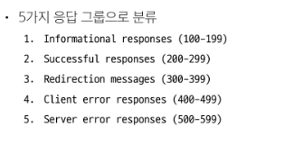
3. 자원의 표현 : JSON 데이터(궁극적으로 표현되는 데이터 결과물)
- 응답 데이터의 변화
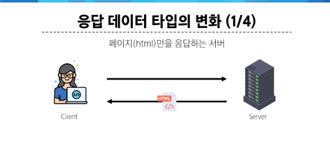
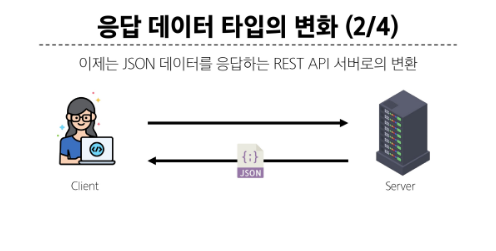
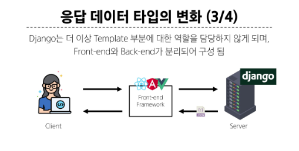
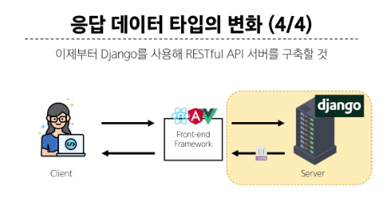

- Json 데이터 응답
---

### Serializer
- 여러 시스템에서 활용하기 위해 데이터 구조나 객체 상태를 나중에 재구성할 수 있는 포맷으로 변환하는 과정

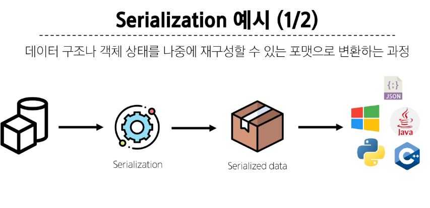
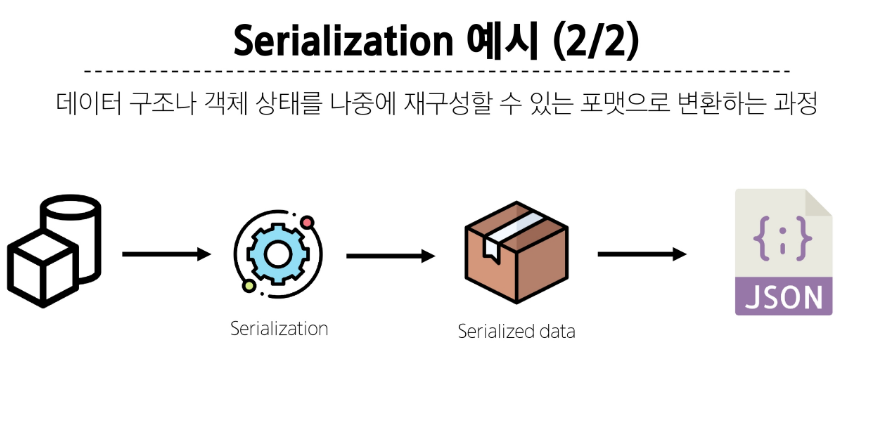

- ModelSerializers class 사용 예시

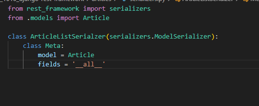
---
- GET 조회
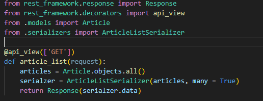
   - many 옵션: Serialize 대상이 QuerySet인 경우 입력
   - data 속성: Serializer data 객체에서 실제 데이터를 추출
   - 'api_view decorator 
    - DRF view 함수에서는 필수로 작성되며 view 함수를 실행하기 전 HTTP 메서드를 확인
    - 기본적으로 GET 메서드만 허용되며 다른 메서드 요청에 대해서는 405 Method Not Allowed 응답
    - DRF view 함수가 응답해야 하는 HTTP 메서드 목록을 작성
---
- POST
- 게시글 데이터 생성하기
- view함수 구조를 method에 따른 분기 처리 GET일 때와 POST일 때
- 응답은 2가지로 201과 400 
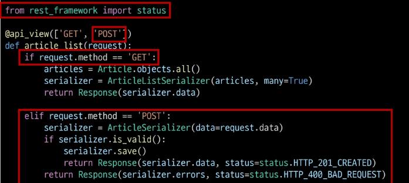
---

- DELETE 삭제
  - 204 상태 반환
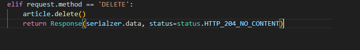 

