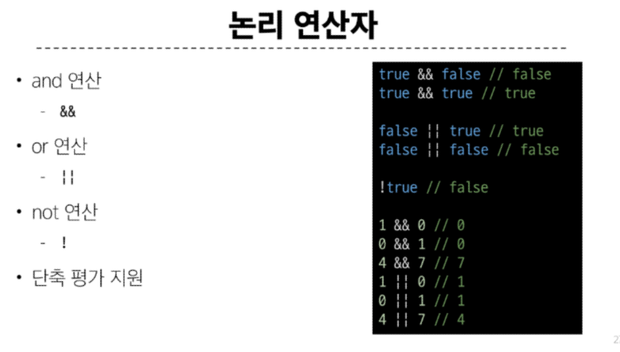

# JavaScript Basic syntax

### 데이터 타입

- 원시 자료형(Primitive type) : 변수에 값이 직접 저장되는 자료형(불변, 값이 복사)
  - Number, String, Boolean, null, undefined
  
```js
const a = 'bar'
console.log(a) // bar

a.toUpperCase()
console.log(a) // bar

let a = 10
let b = a
b = 20
console.log(a) // 10
console.log(b) // 20

```


#### Template literals(템플릿 리터럴)
- 내장된 표현식을 허용하는 문자열 작성 방식
- Backtick(``)을 이용하며, 여러 줄에 걸쳐 문자열을 정의할 수도 있고 JavaScript의 변수를 문자열 안에 바로 연결할 수 있음 .
- ex) '$'와 중괄호({expression})로 표기 

#### null 과 undefined
- null : 프로그래머가 의도적으로 '값이 없음'을 나타낼 때 사용
- undefined : 시스템이나 JavaScript 엔진이 '값이 할당되지 않음'을 나타낼 때 사용

- 참조 자료형(Reference type) : 객체의 주소가 저장되는 자료형(가변, 주소가 복사)
  - Objects(Object,Array,Function)

``` js
const obj1 = { name: 'Alice', age: 30}
const obj2 = obj1
obj2.age = 40

console.log(obj1.age) //40
console.log(obj2.age) //40
```

### 연산자

- 동등 연산자(==)
  - 두 피연산자가 같은 값으로 평가되는지 비교 후 boolean 값을 반환
- 일치 연산자(===)
  - 두 피연산자의 값과 타입이 모두 같은 경우에만 true를 반환

  


### 반복문
- for ...in과 for ...of의 차이점
  - for ...of : 반복가능한 객체에 대해서 반복
```js
  for (variable of iterable) {
  statement;
}
```
  - for ...in : 상속된 열거 가능한 속성들을 포함하여 객체에서 문자열로 키가 지정된 모든 열거 가능한 속성에 대해 반복
