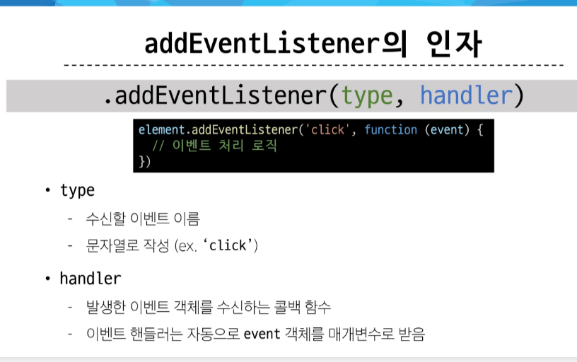

# JS Controlling event

### event
#### 웹에서의 이벤트
- 화면을 스크롤하는 것
- 버튼을 클릭했을 때 팝업 창이 출력되는 것
- 마우스 커서의 위치에 따라 드래그 앤 드롭하는 것
- 사용자의 키보드 입력 값에 따라 새로운 요소를 생성하는 것
-> 웹에서의 모든 동작은 이벤트 발생과 함께 한다.

- event는 무언가 일어났다는 신호 사건 
  - 모든 DOM 요소는 이러한 event를 만들어 냄

- event object : DOM에서 이벤트가 발생했을 때 생성되는 객체
- event 종류 
  - mouse, input, keyboard, tocuh 등등
  - 참고문헌: https://developer.mozilla.org/en-Us/docs/Web/API/Event

#### event가 처리되는 과정
- DOM 요소에서 event가 발생하면, 해당 event는 연결된 이벤트 처리기에 의해 처리 됨

#### event handler
- 특정 이벤트가 발생했을 때 실행되는 함수(이벤트를 처리해줌)

- addEventListener() 
  - 특정 이벤트를 DOM 요소가 수신할 때마다 콜백 함수를 호출
  - EventTarget(DOM요소).addEventListener(type(수신할 이벤트), handler(콜백 함수))
  -> 대상에 특정 Event가 발생하면 지정한 이벤트를 받아 할 일을 등록한다.
  

### 버블링
- 한 요소에 이벤트가 발생하면, 이 요소에 할당된 핸들러가 동작하고, 이어서 부모 요소의 핸들러가 동작하는 현상
- 가장 최상단의 조상 요소(document)를 만날 때까지 이 과정이 반복되면서 요소 각각에 할당된 핸들러가 동작

- ex) form > div > p 형태의 중첩된 구조에 각각 이벤트 핸들러가 연결되어 있을 때 
 요소를 클릭하면 모든 핸들러가 동작

#### event가 정확히 어디서 발생했는지 접근할 수 있는 방법
- event.currentTarget
  - '현재' 요소
  - 항상 이벤트 핸들러가 연결된 요소만을 참조하는 속성
  - 'this'와 같음
- event.target
  - 이벤트가 발생한 가장 안쪽의 요소(target)를 참조하는 속성
  - 실제 이벤트가 시작된 요소
  - 버블링이 진행 되어도 변하지 않음

### 캡처링과 버블링

#### 캡처링
- 이벤트가 하위 요소로 전파되는 단계(버블링과 반대)