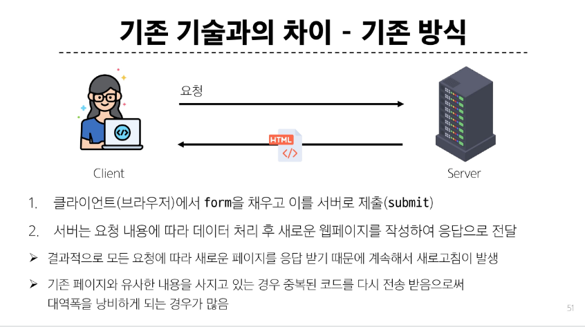

# Asynchronous JavaScript

## 동기와 비동기

#### 동기(Synchronous)
- 프로그램의 실행 흐름이 순차적으로 진행 

-> 하나의 작업이 완료된 후에 다음 작업이 실행되는 방식

#### 비동기(Asynchronous)
- 특정 작업의 실행이 완료될 때까지 기다리지 않고 다음 작업을 즉시 실행하는 방식

-> 작업의 완료 여부를 신경 쓰지 않고 동시에 다른 작업들을 수행할 수 있음

- 병렬적 수행
- 당장 처리를 완료할 수 없고 시간이 필요한 작업들은 백그라운드에서 실행되며 빨리 완료되는 작업부터 처리

---
## JavaScript와 비동기

- Single Thread 언어인 JS
- Threda란?? 작업을 처리할 때 실제로 작업을 수행하는 주체로, multi-thread라면 업무를 수행할 수 있는 주체가 여러 개라는 의미

#### JavaScript Runtime
- JS가 동작할 수 있는 환경 (브라우저 또는 Node.js)
- Single Thread인 JS가 비동기 처리를 할 수 있도록 도와줌

#### 브라우저 환경에서 JS 비동기 처리 관련 요소
1. JS Engine의 Call Stack
2. Web API
3. Task Queue
4. Event Loop

#### 브라우저 환경에서 JS 비동기 처리 동작 방식

1. 모든 작업은 Call Stack(LIF0)으로 들어간 후 처리
2. 오래 걸리는 작업이 Call Stack으로 들어오면 Web API로 보내 별도로 처리하도록 함
3. Web API에서 처리가 끝난 작업들은 Call Stack으로 바로 들어가지 못하고 Task Queue(FIF0)에 순서대로 들어간다.
4. Event Loop가 Call Stack이 비어 있는 것을 계속 체크하다가 비었으면 Task Queue에서 가장 먼저 처리된 작업을 Calls Stack으로 보냄

---

## Ajax 
- 비동기적인 웹 애플리케이션 개발을 위한 기술
- XMLHttpRequest 기술을 사용해 복잡하고 동적인 웹 페이즈를 구성하는 프로그래밍 방식
- 브라우저와 서버 간의 데이터를 비동기적으로 교환하는 기술
- Ajax를 사용하면 페이지 전체를 새로고침 하지 않고도 동적으로 데이터를 불러와 화면을 갱신할 수 있음

#### Ajax 목적
1. 비동기 통신
- 웹 페이지 전체를 새로고침하지 않아도 서버와 데이터를 주고받을 수 있음
2. 부분 업데이트
- 전체 페이지가 다시 로드되지 않고 HTML 페이지 일부 DOM만 업데이트
- 페이지의 일부분만 동적으로 갱신할 수 있어 사용자 경험이 향상
3. 서버 부하 감소
- 필요한 데이터만 요청하므로 서버의 부하를 줄일 수 있음

#### XMLHttpRequest 객체
- 웹 브라우저와 서버 간의 비동기 통신을 가능하게 하는 JavaScript 객체

