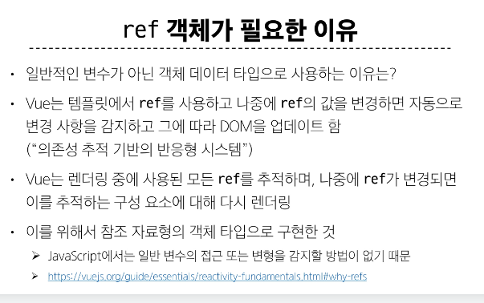

# Vue

### SPA(Single Page Application)
- 단일 페이지에서 동작하는 웹 애플리케이션
#### SPA 작동 원리
- 최초 로드 시 필요한 모든 리소스 다운로드
- 이후 페이지 갱신에 대해 필요한 데이터만을 비동기적으로 전달 받아 화면의 필요한 부분만 동적으로 갱신(AJAX와 같은 기술 사용하여 새로고침 없이 필요한 데이터만 서버로부터 가져옴)
- CSR 방식

### CSR(Client-side Rendering)
- 클라이언트에서 콘텐츠를 렌더링 하는 방식

#### CSR 작동 원리
1. 사용자가 웹사이트에 요청을 보냄
2. 서버는 최소한의 HTML과 JS 파일을 클라이언트로 전송
3. 클라이언트는 HTML과 JS를 다운로드
4. 브라우저가 JS를 실행하여 동적으로 페이지 콘텐츠 생성
5. 필요한 데이터는 API를 통해 서버로부터 비동기적으로 가져옴

### Vue 구조

creatApp함수 -> setup 함수 -> mount로 적용

- ref 함수 
  - 템플릿의 참조에 접근하려면 setup 함수에서 선언 및 반환할 필요가 없음
  - 템플릿에서 ref를 사용할 때는 .value를 작성안해도 value 값을 가져옴

- 이벤트 리스너
  - v-on를 사용하여 DOM 이벤트를 수신할 수 있음

### Template Syntax
- DOM을 기본 구성 요소 인스턴스의 데이터에 선언적으로 바인딩할 수있은 HTML 기반 템플릿 구문을 사용

1. Text Interpolation 
- {{}} 사용, 해당 구성 요소 인스턴스의 msg 속성 값으로 대체
- msg 속성이 변경될 때마다 업데이트

2. Raw HTML 
- 콧수염 구문은 데이터를 일반 텍스트로 해석하기 때문에 실제 HTML을 출력하려면 v-html을 사용해야함
- 

- const rawHtml = ref('') 

3. Attribute Bindings
- 콧수염 구문은 속성 내에서 사용할 수 없기 때문에 v-bind를 사용
- v-bind:id = " "

### ref 객체가 필요한 이유
