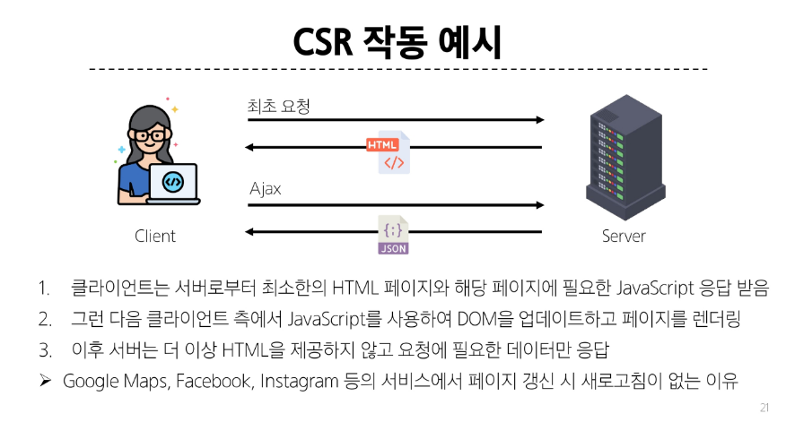

# Vue

### SPA(Single Page Application)
- 단일 페이지에서 동작하는 웹 애플리케이션
#### SPA 작동 원리
- 최초 로드 시 필요한 모든 리소스 다운로드
- 이후 페이지 갱신에 대해 필요한 데이터만을 비동기적으로 전달 받아 화면의 필요한 부분만 동적으로 갱신(AJAX와 같은 기술 사용하여 새로고침 없이 필요한 데이터만 서버로부터 가져옴)
- CSR 방식

### CSR(Client-side Rendering)
- 클라이언트에서 콘텐츠를 렌더링 하는 방식

#### CSR 작동 원리
1. 사용자가 웹사이트에 요청을 보냄
2. 서버는 최소한의 HTML과 JS 파일을 클라이언트로 전송
3. 클라이언트는 HTML과 JS를 다운로드
4. 브라우저가 JS를 실행하여 동적으로 페이지 콘텐츠 생성
5. 필요한 데이터는 API를 통해 서버로부터 비동기적으로 가져옴

