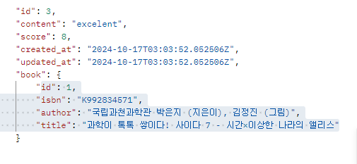
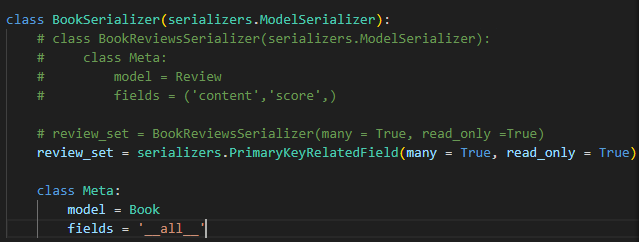
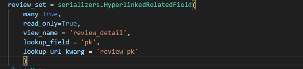
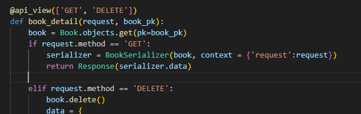

```py
class ReviewSerializer(serializers.ModelSerializer):
    class Meta:
        model = Review
        # exclude = ('book',)
        fields = '__all__'
        read_only_fields = ('book',)
        depth = 1
        
```
- depth = 1을 추가했을 때 결과

 -> book에 대한 정보가 같이 출력됨

 ---


 
 - 역참조하고 있는 모델의 pk를 가져옴

 ---
 

 
 - 하이퍼링크 출력하는 방법