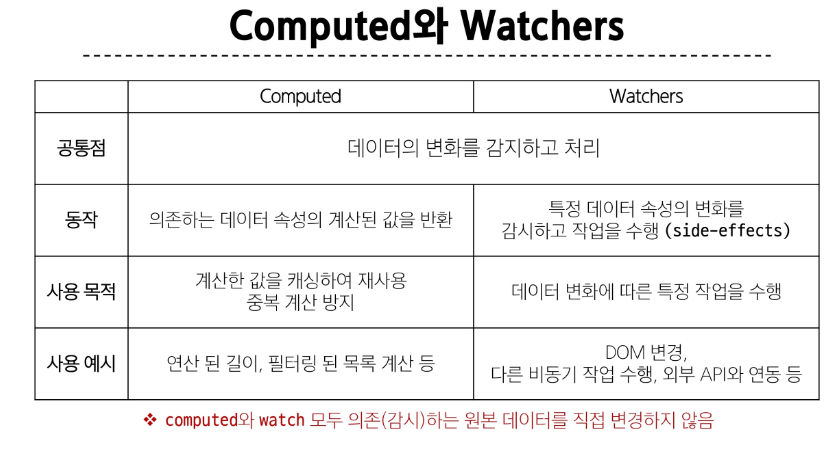

# Vue Basic Syntax 

### Computed
- 미리 계산된 속성을 사용하여 템플릿에서 표현식을 단순하게 하고 불필요한 반복 연산을 줄이는 함수


- 반환되는 값은 computed ref이며 일반refs와 유사하게 계산된 결과를 .value로 참조할 수 있음(템플릿에서는 .value 생략 가능)
- computed 속성은 의존된 반응형 데이터를 자동으로 추적
- 의존하는 데이터가 변경될 때만 재평가


#### computed와 method 차이
- computed 속성은 의존된 반응형 데이터를 기반으로 캐시됨
- 즉, 의존된 반응형 데이터가 변경되지 않는 한 이미 계산된 결과에 대한 여러 참조는 다시 평가할 필요 없이 이전에 계산된 결과를 즉시 반환
-> 반면, method 호출은 다시 렌더링이 발생할 때마다 항상 함수를 실행

---

### Conditional Rendering

- v-if : 표현식 값의 true/false를 기반으로 요소를 조건부로 렌더링
  - v-else,v-else-if를 사용하여 v-if에 대한 else 블록 나타낼 수 있음
  - HTML 템플릿 요소에 v-if를 사용하여 하나 이상의 요소에 대해 적용 할 수 있음
  ```html
      <template v-if = "name === 'Cathy'">
      <div>Cathy입니다</div>
      <div>나이는 30살입니다</div>
    </template>
  ```
  **HTML<template>element**
  - 페이지가 로드 될 때 렌더링 되지 않지만, JS를 사용하여 나중에 문서에서 사용할 수 있도록 하는 HTML을 보유하기 위한 메커니즘
- v-show와 v-if
  - v-if는 초기 조건이 false인 경우 아무 작업도 수행하지 않음, 토글 비용이 높음
  - v-show는 초기 조건에 관계 없이 항상 렌더링, 초기 렌더링 비용이 더 높음

  => 콘텐츠를 매우 자주 전환해야 하는 경우에는 v-show를, 실행 중에 조건이 변경되지 않는 경우에는 v-if를 권장

---
### List Rendering
- v-for : alias in expression 형식
- 인덱스(객체는 key)에 대한 별칭을 지정할 수 있음


- v-for로 객체를 순회할 때 순서는 value-key 순서
- v-if가 v-for보다 우선순위가 더 높기 때문에 동일 요소에 v-for와 v-if를 함께 사용하지 않는다
  - 해결법 
    - 1. computed 활용
    - 2. v-for와 template 활용
#### v-for with key
- 내부 컴포넌트의 상태를 일관 되게 하여 데이터의 예측 가능한 행동을 유지하기 위함

---

### Watchers

- watch() : 하나 이상의 반응형 데이터를 감시하고, 감시하는 데이터가 변경되면 콜백 함수를 호출


### computed vs watch


---

### Lifecycle Hooks
- Vue 컴포넌트의 생성부터 소멸까지 각 단계에서 실행되는 함수


