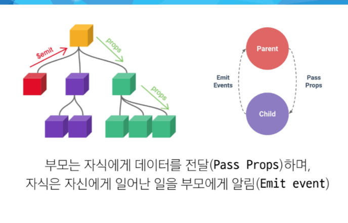
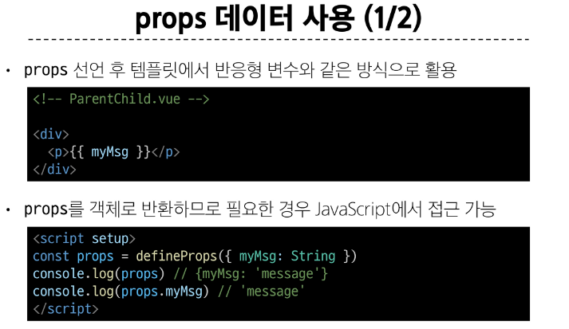

# Component State Flow

### Passing Props

#### Props
 : 부모는 자식에게 데이터를 전달 하며, 자식은 자신에게 일어난 일을 부모에게 알림
- 부모 컴포넌트로부터 자식 컴포넌트로 데이터를 전달하는데 사용되는 속성
- 부모 속성이 업데이트 되면 자식으로 전달 되지만, 자식이 업데이트 될 때 부모로 전달 되는 것은 안됨
- 부모 컴포넌트가 업데이트될 때마다 이를 사용하는 자식 컴포넌트의 모든 props가 최신 값으로 업데이트 됨
=> 부모 컴포넌트에서만 변경하고 이를 내려 받는 자식 컴포넌트는 자연스럽게 갱신

**One-way Data Flow**
- 모든 props는 자식 속성과 부모 속성 사이에 하향식 단방향 바인딩을 형성(one-way-down binding) 
  - 단방향인 이유는 하위 컴포넌트가 실수로 상위 컴포넌트의 상태를 변경하여 앱에서의 데이터 흐름을 이해하기 어렵게 만드는 것을 방지하고 데이터 흐름의 일관성과 단순화를 위함

#### Props 선언 
- 부모 컴포넌트에서 내려 보낸 props를 사용하기 위해서는 자식 컴포넌트에서 명시적인 props 선언이 필요
- 부모 컴포넌트에서 자식 컴포넌트에 보낼 props 형식은 
"props 이름 = props 값"
- my-msg 처럼 kebab-case 형식으로 작성한 props는 내부적으로 myMsg라는 camelCase 형식으로 변환됨, Vue가 HTML 속성 명명 규칙과 JavaScript 명명 규칙을 자동으로 맞추기 위해, kebab-case 형식을 camelCase로 변환하는 과정을 거칩니다.
- defineProps()를 사용하여 props를 선언, defineProps()에 작성하는 인자의 데이터 타입에 따라 선언 방식이 나뉨

  - 2가지 선언 방식
  1. 문자열 배열을 사용한 선언
     defineProps(['props이름'])
  2. 객체를 사용한 선언(객체 선언 문법 사용 권장)
     defineProps({key(props이름) : value(값이 될 데이터의 타입에 해당하는 생성자 함수)})
#### props 데이터 사용

#### 한 단계 더 props 보내기
- 부모,자식,손자 컴포넌트가 존재할 때 손자 컴포넌트에서 props를 받을라면 v-bind를 사용한 동적 props를 선언해야한다.

#### 정적 props와 동적 props

- 반응형 데이터를 활용해 v-바인드나 v-for를 활용해 동적 props를 선언해서 사용할 수 있다.

---

### Component Events
#### Emit

- $emit() : 자식 컴포넌트가 이벤트를 발생시켜 부모 컴포넌트로 데이터를 전달하는 역할의 메서드
  - '$' 표기는 Vue 인스턴스의 내부 변수들을 가리킴
  - $emit(event(커스텀 이벤트 이름), ...args(추가 인자))

- 이벤트 발신 및 수신
 - @event 형태 = "$emit('이벤트 이름')"
 - 부모 컴포넌트에서 v-on을 사용하여 @'이벤트이름' = "함수"