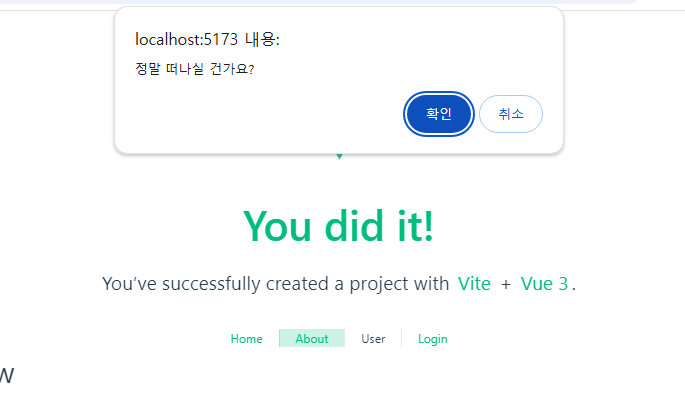
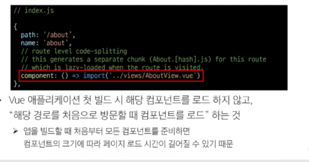

# 라우팅

### 라우팅 기본 


### Named Routes (경로에 이름을 지정하는 라우팅)
- name 속성 값에 경로에 대한 이름을 지정
- 경로에 연결하려면 RouterLink에 v-bind를 사용해 'to' props 객체로 전달
---
### 동적 경로 매칭

```vue
<template>
  <div>
    <h1>UserView</h1>
    <h2>{{userId}}번 User 페이지</h2>
    <h2>{{$route.params.id}}</h2>
  </div>
</template>

<script setup>
import { ref } from 'vue'
import { useRoute } from 'vue-router';

const route = useRoute()
const userId = ref(route.params.id)
</script>
```
---

### Nested Routes(중첩된 라우팅)


1. components 폴더에 중첩시킬 컴포넌트 생성
2. 라우터 등록 - index.js에 컴포넌트 import
- children 옵션 활용  
  - 배열 형태로 필요한 만큼 중첩 관계를 표현할 수 있음

---

### Programmatic Navigation 
- RouterLink 대신 JavaScript를 사용해 페이지를 이동하는 것

- router의 메서드
  - router.push() 다른 위치로 이동하기 (뒤로가기 가능)
    - history stack에 push하므로 기록이 남음
  - router.replace() 현재 위치 바꾸기 (뒤로가기 불가능)


---

### Navigation Guard

- Vue router를 통해 특정 URL에 접근할 때 다른 URL로 redirect를 하거나 취소하여 내비게이션을 보호 
=> 라우트 전환 전/후 자동으로 실행되는 Hook
ex) 로그인 사용자는 로그인 컴포넌트로 못가게 보호하거나 비로그인 사용자는 메인 컴포넌트로 못가게 보호하는 역할


- 종류
1. Globally(전역 가드)
- 앱 전역에서 모든 라우트 전환에 적용되는 가드
  - router.beforeEach(to, from): 다른 URL로 이동하기 직전에 실행되는 함수, {to : 이동 할 URL 정보가 담긴 Route 객체}, {from: 현재 URL 정보가 담긴 Route 객체}

    => 선택적으로 다음 값 중 하나를 반환
     return false or Route Location
  - router.beforeResolve()
  - router.afterEach()
2. Per-route(라우터 가드)
- 특정 라우트에만 적용되는 가드
- beforeEnter(to, from) : 특정 라우트안에서 작성, URL의 매개변수나 쿼리 값이 변경될 때는 실행 X 다른 URL에서 변경이 될 때만 실행
3. In-component(컴포넌트 가드)
- 컴포넌트 내에서만 적용되는 가드 -> ex) user/1에서 user/2로 변환될 때
- onBeforeRouteLeave(): 현재 라우트에서 다른 라우트로 이동하기 전에 실행 => 사용자가 현재 페이지를 떠나는 동작에 대한 로직을 처리

```vue
onBeforeRouteLeave((to, from) => {
  const answer = window.confirm('정말 떠나실 건가요?')
  if (answer === false) {
    return false
  }
})
```



- onBeforeRouteUpdate(): 이미 렌더링 된 컴포넌트가 같은 라우트 내에서 업데이트 되기 전에 실행 => 라우트 업데이트 시 추가적인 로직을 처리

---


### Lazy Loading Routes 
