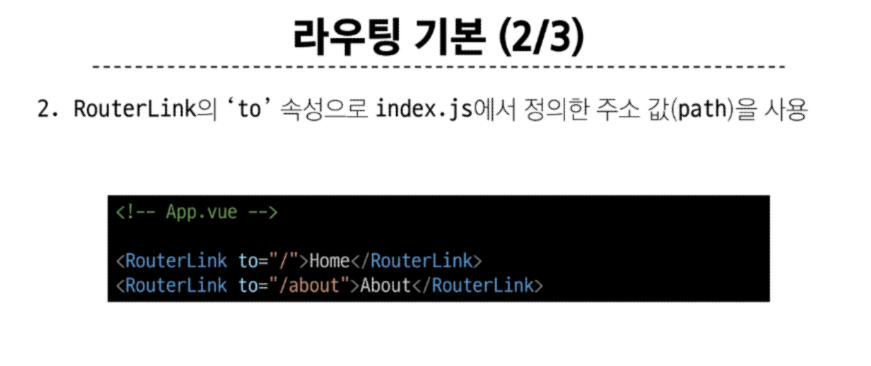
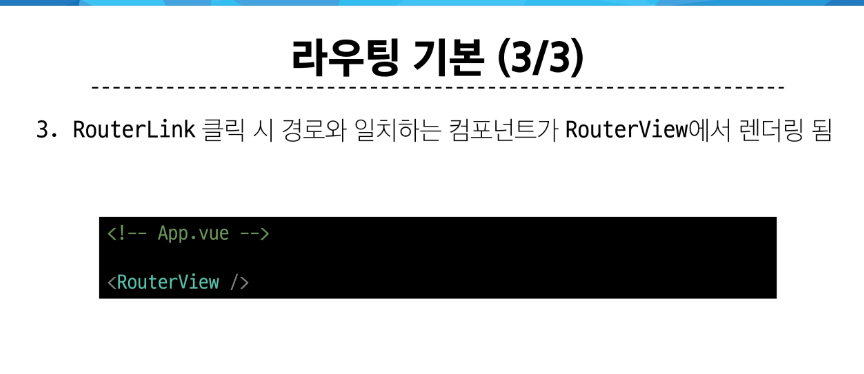
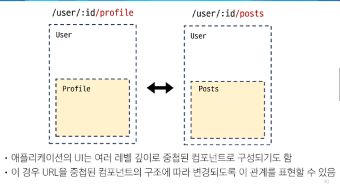

# 라우팅

### 라우팅 기본 





### Named Routes (경로에 이름을 지정하는 라우팅)
- name 속성 값에 경로에 대한 이름을 지정
- 경로에 연결하려면 RouterLink에 v-bind를 사용해 'to' props 객체로 전달
---
### 동적 경로 매칭

```vue
<template>
  <div>
    <h1>UserView</h1>
    <h2>{{userId}}번 User 페이지</h2>
    <h2>{{$route.params.id}}</h2>
  </div>
</template>

<script setup>
import { ref } from 'vue'
import { useRoute } from 'vue-router';

const route = useRoute()
const userId = ref(route.params.id)
</script>
```
---

### Nested Routes(중첩된 라우팅)



1. components 폴더에 중첩시킬 컴포넌트 생성
2. 라우터 등록 - index.js에 컴포넌트 import
- children 옵션 활용  
  - 배열 형태로 필요한 만큼 중첩 관계를 표현할 수 있음

---

### Programmatic Navigation 
- RouterLink 대신 JavaScript를 사용해 페이지를 이동하는 것

- router의 메서드
  - router.push() 다른 위치로 이동하기 (뒤로가기 가능)
  - router.replace() 현재 위치 바꾸기 (뒤로가기 불가능)