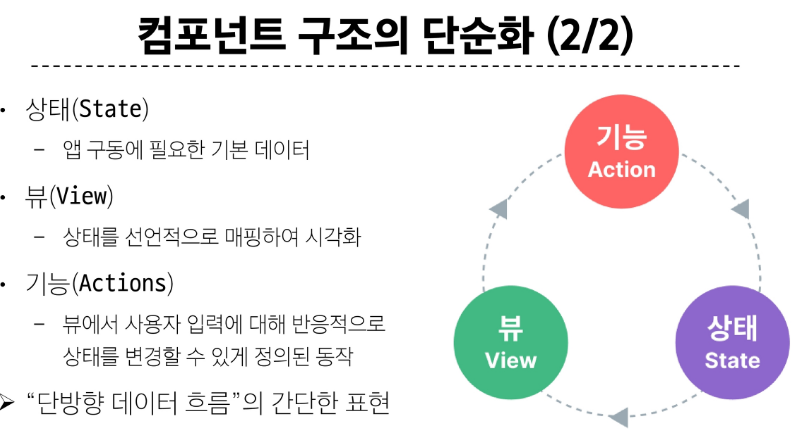
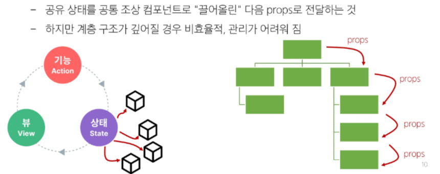
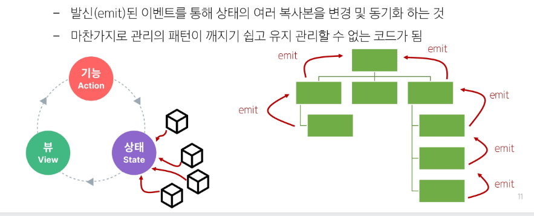
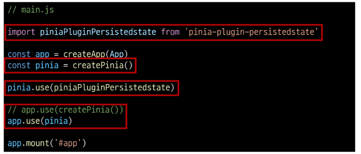

# State Management 

### 컴포넌트 구조의 단순화 

### 상태 관리의 단순성이 무너지는 시점
1. 여러 컴포넌트가 상태를 공유할 때 
- 여러 뷰가 동일한 상태에 종속되는 경우

- 서로 다른 뷰의 기능이 동일한 상태를 변경시켜야 하는 경우

=> 해결책 
- 각 컴포넌트의 공유 상태를 추출하여, 전역에서 참조할 수 있는 저장소에서 관리-Pinia

### Pinia

#### Pinia 구성 요소
1. store 
- 중앙 저장소
- 모든 컴포넌트가 공유하는 상태, 기능 등이 작성됨
- export const로 defineStore()의 반환 값을 지정할 때 이름은 use와 store를 사용하는 것을 권장
- defineStore()의 첫번째 인자는 앱 전체에 걸쳐 사용하는 store의 고유 id
2. state
- ref() 데이터
3. getters
- computed() 계산된 값
4. actions
- function() 메서드

state,getters,actions는 모두 return을 해줘야함

5. plugin

---

js에서 value값을 초기화 하는 함수 .value.reset()

### Local Storage(Pinia 플러그인)
- 브라우저 내에 key-value 쌍을 저장하는 웹 스토리지 객체
- 페이지를 새로고침하고 브라우저를 다시 실행해도 데이터가 유지
- 쿠키와 다르게 네트워크 요청 시 서버로 전송되지 않음
- 여러 탭이나 창 간에 데이터를 공유할 수 있음
- npm i pinia-plugin-persistedstate

