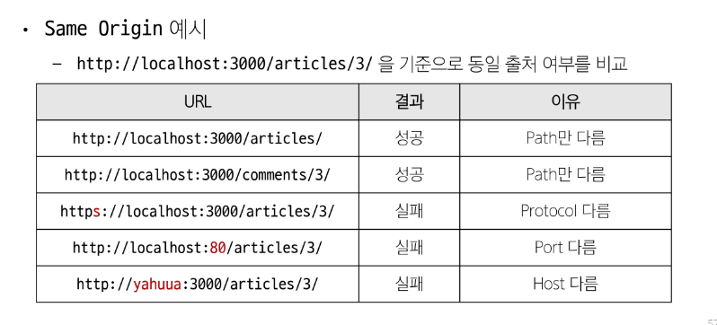

# Vue with DRF 01

### frontend 프레임워크와 backend 프레임워크 간의 요청과 응답 과정

1. 게시글 목록 출력
- ArticleView 컴포넌트에 ArticleList와 ArticleListItem 컴포넌트 등록

- DRF로부터 데이터를 요청 후 데이터를 응답 받아 store에 저장 후 출력
  - npm install axios 필요

- DRF 서버측에서는 응답을 해도 'localhost:5173'에서 api의 XMLHttpRequest에 대한 접근이 CORS policy로 인해 차단되어서 브라우저에 출력되지 않는다.

2. 게시글 생성 
- v-model을 사용해 사용자 입력 데이터를 양방향 바인딩
- v-model의 trim 수식어를 사용해 사용자 입력 데이터의 공백을 제거
---

### SOP (Same-origin polic) : 동일 출저 정책
- 어떤 출처(Origin)에서 불러온 문서나 스크립트가 다른 출처에서 가져온 리소스와 상호 작용하는 것을 제한하는 보완 방식
- 다른 곳에서 가져온 자료는 block
- 웹 애플리케이션의 도메인이 다른 도메인의 리소스에 접근하는 것을 제어하여 사용자의 개인 정보와 데이터의 보안을 보호하고, 잠재적인 보안 위협을 방지
- 잠재적으로 해로울 수 있는 문서를 분리함으로써 공격받을 수 있는 경로를 줄임

#### Origin(출처)
- URL의 Protocol,Host,Port를 모두 포함하여 "출처"라고 부름
- Same Origin
ex) http:localhost:3000/posts/3
Scheme/Protocol Host Port 이 세 영역이 일치하는 경우에만 Same Origin으로 인정

### CORS Policy
- SOP에 의해 다른 출처의 리소스와 상호작용하는 것이 제한되는데 실제 웹 애플리케이션에서는 다양한 출처로부터 리소스를 요청하는 경우가 많기 때문에 CORS 정책이 필요

- CORS는 웹 서버가 리소스에 대한 서로 다른 출처 간 접근을 허용하도록 선택할 수 있는 기능을 제공
    - CORS (Cross-Origin-Resource Sharing) : 교차 출처 리소스 공유
        - 다른 출처의 리소스에 접근할 수 있는 권한을 부여하도록 브라우저에 알려주는 체제

